# CloudToLocalLLM Deployment Workflow Diagram

## 🔄 **Visual Deployment Flow**

```mermaid
graph TD
    A[🔍 Pre-flight Checks] --> B{Environment OK?}
    B -->|❌ No| A1[Fix Environment Issues]
    A1 --> A
    B -->|✅ Yes| C[📋 Phase 1: Version Management]
    
    C --> C1[Increment Version]
    C1 --> C2[Sync Version References]
    C2 --> C3[Commit Changes]
    C3 --> C4[Push to Git]
    C4 --> D[🔨 Phase 2: Build & Package]
    
    D --> D1[Clean Build Environment]
    D1 --> D2[Build Linux Desktop]
    D2 --> D3[Build Web Application]
    D3 --> D4[Create Binary Package]
    D4 --> E[📦 Phase 3: AUR Deployment]
    
    E --> E1[Update PKGBUILD]
    E1 --> E2[Test Package Locally]
    E2 --> E3{Package Builds?}
    E3 -->|❌ No| E4[Fix Package Issues]
    E4 --> E2
    E3 -->|✅ Yes| E5[Generate .SRCINFO]
    E5 --> E6[Submit to AUR]
    E6 --> F[🌐 Phase 4: VPS Deployment]
    
    F --> F1[SSH to VPS]
    F1 --> F2[Pull Latest Changes]
    F2 --> F3[Run Deployment Script]
    F3 --> F4[Verify VPS Status]
    F4 --> G[✅ Comprehensive Verification]
    
    G --> G1[Run Verification Script]
    G1 --> G2{All Checks Pass?}
    G2 -->|❌ No| H[🔧 Troubleshooting]
    H --> H1[Identify Issues]
    H1 --> H2[Apply Fixes]
    H2 --> H3{Fixed?}
    H3 -->|❌ No| H4[🔙 Rollback]
    H4 --> I[📝 Document Failure]
    H3 -->|✅ Yes| G1
    G2 -->|✅ Yes| J[🎉 Deployment Complete]
    
    J --> K[📋 Update Documentation]
    K --> L[🏆 Deployment Certificate]
    
    style A fill:#e1f5fe
    style J fill:#c8e6c9
    style H4 fill:#ffcdd2
    style L fill:#fff3e0
```

## 🎯 **Component Synchronization Flow**

```mermaid
graph LR
    A[pubspec.yaml] -->|Version Source| B[sync_versions.sh]
    B --> C[assets/version.json]
    B --> D[aur-package/PKGBUILD]
    
    C --> E[Flutter Web Build]
    D --> F[AUR Package Build]
    E --> G[VPS Deployment]
    F --> H[AUR Repository]
    
    G --> I[version.json endpoint]
    H --> J[AUR Package Page]
    I --> K[Verification Script]
    J --> K
    
    K --> L{Versions Match?}
    L -->|✅ Yes| M[✅ Success]
    L -->|❌ No| N[❌ Version Mismatch]
    
    style A fill:#ffeb3b
    style M fill:#4caf50
    style N fill:#f44336
```

## 🔧 **Troubleshooting Decision Tree**

```mermaid
graph TD
    A[❌ Deployment Failed] --> B{What Failed?}
    
    B -->|Version Mismatch| C[Run sync_versions.sh]
    C --> C1[Verify All Files Updated]
    C1 --> C2[Recommit and Push]
    
    B -->|Build Failure| D[Check Flutter Doctor]
    D --> D1[Clean Build Environment]
    D1 --> D2[Rebuild from Scratch]
    
    B -->|AUR Package| E[Check PKGBUILD Syntax]
    E --> E1[Update Checksums]
    E1 --> E2[Test Local Build]
    
    B -->|VPS Issues| F[Check Container Logs]
    F --> F1[Verify SSH Access]
    F1 --> F2[Restart Services]
    
    B -->|Network Issues| G[Check Internet Connection]
    G --> G1[Verify DNS Resolution]
    G1 --> G2[Test VPS Accessibility]
    
    C2 --> H[Re-run Verification]
    D2 --> H
    E2 --> H
    F2 --> H
    G2 --> H
    
    H --> I{Fixed?}
    I -->|✅ Yes| J[✅ Continue Deployment]
    I -->|❌ No| K[🔙 Rollback Required]
    
    style A fill:#f44336
    style J fill:#4caf50
    style K fill:#ff9800
```

## 📊 **Deployment Timeline**

## 🎯 **Success Criteria Matrix**

| Component | Check | Expected Result | Verification Command |
|-----------|-------|----------------|---------------------|
| **Git Repository** | Version | 3.1.3+001 | `./scripts/version_manager.sh get` |
| **Assets** | Version File | 3.1.3+001 | `grep version assets/version.json` |
| **AUR Package** | PKGBUILD | 3.1.3 | `grep pkgver= aur-package/PKGBUILD` |
| **VPS Web** | Version Endpoint | 3.1.3 | `curl -s https://app.cloudtolocalllm.online/version.json` |
| **VPS Main** | Accessibility | HTTP 200 | `curl -I https://cloudtolocalllm.online` |
| **AUR Live** | Package Version | 3.1.3-1 | `curl -s "https://aur.archlinux.org/packages/cloudtolocalllm"` |

## 🚨 **Critical Failure Points**

## 🔄 **Rollback Strategy**

This visual documentation provides clear flowcharts and decision trees to help users understand the deployment process, identify failure points, and execute proper recovery procedures.
